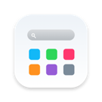
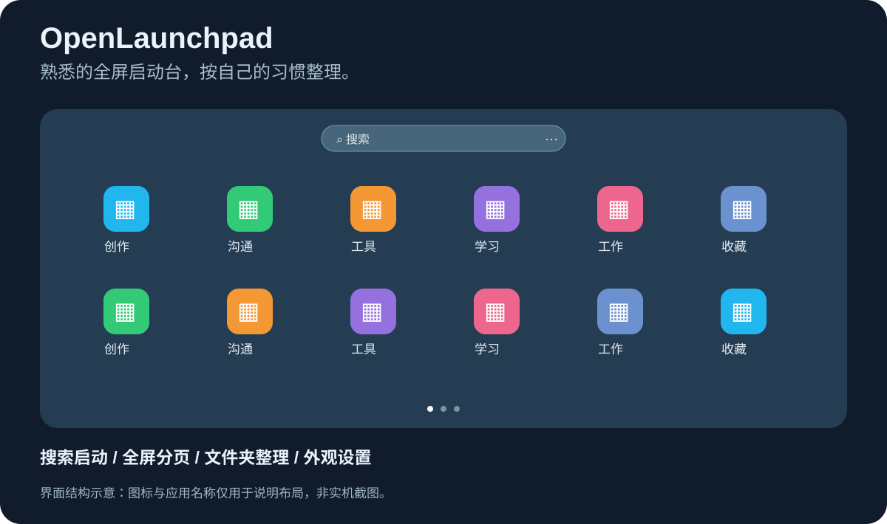

<div align="center">
  
  <h1>OpenLaunchpad</h1>
  <p><strong>熟悉的全屏启动台，按自己的习惯整理。</strong></p>
  <p>Swift / AppKit 原生实现 · 本地布局保存 · 可修改源码</p>
  <p><a href="https://github.com/Ayang0097/OpenLaunchpad/releases/latest">下载安装包</a> · <a href="#快速开始">快速开始</a> · <a href="https://github.com/Ayang0097/OpenLaunchpad/issues">反馈问题</a></p>
</div>



> 配图为界面结构与操作流程示意，不是实机截图；图中的应用名称和图标仅用于说明。实际应用列表来自你的 Mac，背景来自你的系统壁纸。

## 它能帮你做什么

OpenLaunchpad 是一个原生 macOS 全屏应用启动台：把分散的应用放到同一个入口，通过搜索、分页和文件夹找到它们。你可以调整排列和外观，也可以继续修改源码，做成适合自己使用习惯的工具。

它适合喜欢经典启动台布局、希望通过键盘快速找应用，或想拥有一个可自行维护启动器的用户。当前版本为 **v0.1.0**，仍处于早期迭代阶段。本项目与 Apple 或 BuhoLaunchpad 无隶属关系。

## 从打开应用，到整理桌面

### 输入名字，直接启动

唤出启动台后，在顶部搜索框输入应用名称，列表会按名称筛选。按 **Return** 打开首个匹配结果；按 **Escape** 清空搜索。搜索框右侧的更多按钮可以打开设置或关闭启动台。

搜索框采用半透明底色、浅色图标和细描边，让入口保持清晰。搜索范围来自当前布局中的应用，不是全盘文件搜索。

### 让应用留在习惯的位置

应用以网格分页显示。你可以拖动应用调整顺序，在页面左右边缘停留后移到其他页，或将常用应用合并成文件夹。

建文件夹需要在目标图标中央停留约 **0.6 秒**，等待提示后再松手；边缘停留约 **0.55 秒**会翻页。打开文件夹后，点击标题可改名，右键菜单可解散文件夹。目前还不支持把整个文件夹一起拖动。


### 保留全屏空间，也保留调整余地

页面支持圆点切换、键盘翻页和应用内双指横向滑动。设置中可以调整每页行列数、壁纸模糊程度、暗色覆盖和唤出热角。

背景使用当前系统壁纸模糊后叠加暗色层；它不会实时模糊后方其他窗口。改变行列数会重新分页，所以建议先备份自己的布局。

| 功能 | 当前行为 |
| --- | --- |
| 应用入口 | 菜单栏按钮、Control + Option + L、可选热角 |
| 翻页 | 底部圆点、Command + 左右方向键、应用内双指横滑 |
| 搜索 | 按名称匹配，Return 打开首个结果 |
| 整理 | 应用拖动、边缘翻页、创建/改名/解散文件夹 |
| 编辑模式 | 长按图标或按 Option，Escape 退出 |
| 删除应用 | 仅检测到 App Store 收据的应用显示删除入口，确认后移到废纸篓 |
| 外观 | 行列数、壁纸模糊强度、暗色覆盖 |
| 数据 | 页面、顺序和文件夹保存在本机 JSON 文件 |

## 快速开始

**环境要求：Apple Silicon（arm64）Mac，macOS 14 或以上。当前没有 Intel 安装包。**

1. 前往 [Releases 下载最新 ZIP](https://github.com/Ayang0097/OpenLaunchpad/releases/latest)。
2. 解压，将 **OpenLaunchpad.app** 拖到“应用程序”文件夹。
3. 打开应用；之后可以通过菜单栏九宫格按钮或 **Control + Option + L** 唤出。
4. 搜索一个应用试用，或通过搜索框右侧更多按钮打开设置。

安装包使用 ad-hoc 签名，尚未经过 Apple 公证。macOS 可能阻止首次打开；确认信任本项目后，可按照“系统设置 → 隐私与安全性”中的提示允许打开。Release 同时提供 SHA256 校验文件。

直接拖入“应用程序”文件夹不会自动设置登录启动。需要登录后后台运行时，请使用下方源码中的安装脚本。

## 常用操作速查

| 想做什么 | 如何操作 |
| --- | --- |
| 显示或隐藏启动台 | Control + Option + L |
| 打开搜索结果 | 输入名称，按 Return |
| 切换页面 | Command + ← / →，或点击分页圆点 |
| 取消当前操作 | Escape，按当前状态依次取消拖动、编辑、搜索或文件夹 |
| 调整应用顺序 | 拖动应用到目标位置后松手 |
| 移到其他页 | 拖到页面边缘并停留，翻页后放置 |
| 创建文件夹 | 拖到另一图标中央，等待提示后松手 |
| 重命名文件夹 | 打开文件夹，点击标题 |
| 解散文件夹 | 右键文件夹，选择解散 |

## 数据留在本机，也方便备份


应用从本机应用程序目录扫描，排列保存到独立的布局文件。源码仓库和发行包不会携带你的个人布局。升级或大幅调整排列前，可以复制一份 layout.json；恢复时先退出应用，再用备份替换它。

## 常见问题

**这是苹果原生 Launchpad 吗？** 不是。它是使用 Swift / AppKit 独立编写的启动器，参考经典全屏启动台的操作方式，不代表与原版功能完全一致。

**可以用系统捏合手势唤出吗？** 当前不支持系统级捏合唤出。可使用菜单栏、快捷键或设置中的热角。

**删除图标会卸载应用吗？** 编辑模式中的删除操作会在确认后把对应应用移到废纸篓，并非仅隐藏图标。只有检测到 App Store 收据的应用显示该入口。

**所有应用都会自动出现吗？** 应用会从指定应用程序目录扫描；临时不可访问的应用重新出现后，排列位置可能变化。遇到遗漏可以在 Issues 中说明安装位置和应用名称。

**可以继续修改吗？** 源码和图标生成脚本都在仓库中，可在本机调整后重新构建。主要界面与交互实现位于 Sources/main.swift，图标位于 make_icon.swift。

## 从源码构建

需要 Xcode Command Line Tools（Swift、iconutil、codesign）以及运行迁移/测试脚本所需的 Python 3。

```sh
git clone https://github.com/Ayang0097/OpenLaunchpad.git
cd OpenLaunchpad
./build.sh
open dist/OpenLaunchpad.app
```

安装或更新到 /Applications，并添加登录后台启动：

```sh
./install.sh
```

图标由 make_icon.swift 生成；修改后再次构建会自动更新图标资源。

## 数据与可选迁移

布局保存在：

```text
~/Library/Application Support/OpenLaunchpad/layout.json
```

该文件属于用户数据，不随仓库发布。备份此文件即可保存个人排列。

如本机存在 BuhoLaunchpad 的布局数据库，可在首次使用前执行：

```sh
python3 migrate_buho_layout.py
```

迁移只读原数据库；目标布局已存在时会停止。该脚本依赖第三方数据库结构，不能保证适配所有版本。restore_original.sh 仅在 BuhoLaunchpad 仍安装时停用 OpenLaunchpad 的登录启动并打开原应用。

## 验证与已知边界

```sh
python3 Tests/layout_regression.py
zsh -n build.sh install.sh restore_original.sh
./build.sh
```

布局回归检查覆盖页面溢出、顺序、重复应用、空/单项文件夹和空布局。它不能替代真实触控板手感验证。

- 暂不支持系统级捏合唤出、文件夹整体拖动和 Intel 安装包。
- 背景来自模糊后的系统壁纸，不是实时模糊其他窗口。
- 应用扫描在主线程执行；临时不可访问的应用重新出现后，位置可能变化。
- 减少动态效果偏好尚未完整覆盖，保存失败目前记录日志。
- 本项目处于早期迭代阶段，重要布局建议定期备份。
